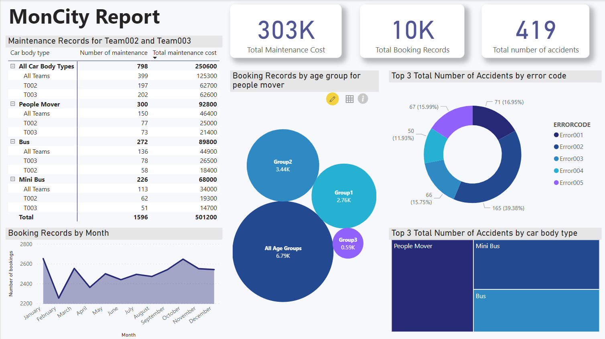

# FIT3003 Business Intelligence and Data Warehousing
## Assignment 1 - Optimising Vehicle Investment Decisions via Advanced OLAP Queries

### Data Warehousing 
#### Preparation Stage Files:
- SQL Code > Task_C1.sql
#### Star Schema Implementation Files:
- SQL Code > Task_C2.sql

### OLAP Reports
- SQL Code > Task_C3_Report1_4.sql
- SQL Code > Task_C3_Report5_8.sql
- Results: OLAP Reports Folder

### Business Intelligence Report
Dashboard File:
- Task_C4.pbix

